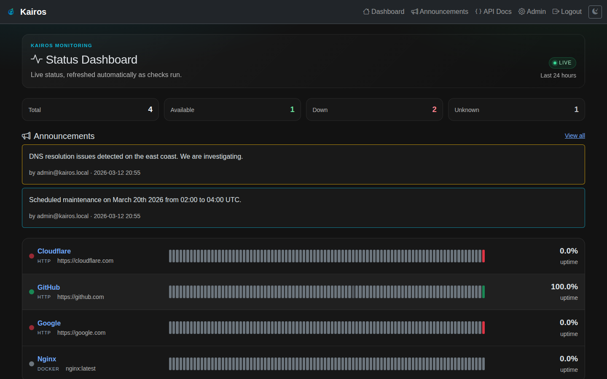
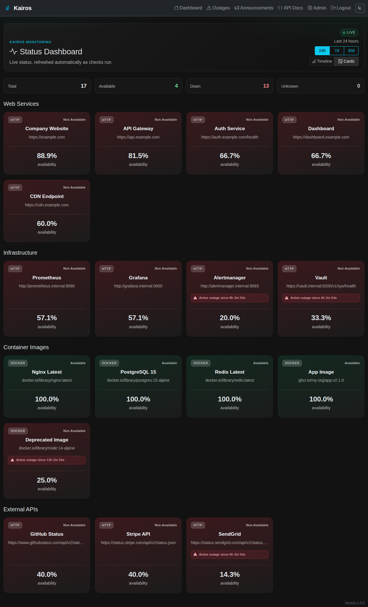
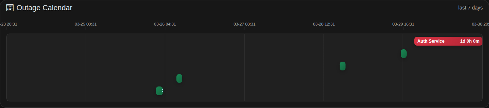
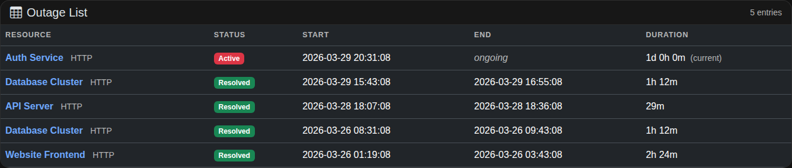

# Kairos - Uptime Monitor


[](https://github.com/wenisch-tech/Kairos/releases)
[](LICENSE.md)
[](https://github.com/wenisch-tech/Kairos/pkgs/container/kairos)
[](https://artifacthub.io/packages/helm/jfwenisch/kairos)
[](https://github.com/wenisch-tech/Kairos/actions)

**Kairos** is a self-hosted uptime and availability monitoring application built with Spring Boot. It periodically checks whether your HTTP services and Docker images are reachable, can discover Docker images from repository prefixes, stores a full check history, and presents the results on a clean status dashboard - with Prometheus metrics included.

---

## Screenshots



| Screenshot | Description |
|---|---|
|  | **Status Dashboard (Timeline view)** — 24-hour timeline bars per resource, uptime percentages, and active outage indicators across multiple groups. |
|  | **Status Dashboard (Card view)** — card based overview per resource, uptime percentages, and active outage indicators across multiple groups. |
|  | **Resource Detail** — Full check history table with status, response time, and error codes; manual "Check Now" button and outage history. |
|  | **Admin · Manage Resources** — Add, edit, and delete monitored resources; drag-and-drop reordering within and across groups. |
|  | **Admin · Resource Type Configuration** — Configure check intervals, parallelism, outage and recovery thresholds per resource type (HTTP, Docker, Docker Repository). |
|  | **Admin · Announcements** — Create and manage rich-text status announcements with severity levels and optional auto-expiry. |
|  | **Admin · API Keys** — Generate and revoke named API keys for machine-to-machine access to the REST API. |
|  | **Admin · Users** — Manage local user accounts and passwords. |
|  | **Admin · General Settings** — Application-wide settings including public submission mode and OIDC configuration. |
|  | **Outages · Calendar (Timeline view)** — Gantt-style outage calendar showing per-resource outage bars across a 7-day window with time-axis ticks and active outage highlight. |
|  | **Outages · List** — Tabular outage log with resource name, type, active/resolved status badge, start time, end time, and duration; supports filtering by status and time range. |

---

## Features

- **HTTP monitoring** - HTTP GET checks with configurable interval and parallelism
- **Latency tracking** - end-to-end request latency measured per check and broken down into DNS resolution, TCP connect, and TLS handshake phases; stored in the database and displayed as an interactive trend chart on the resource detail page with individual data points, tooltips, zoom (1×–8×), drag-to-pan, and a time axis; also shows latest and average latency per resource on the dashboard; the chart adapts to the selected time range (24 h / 7 d / 30 d) by fetching real per-check samples from the API and downsampling client-side so detail is preserved when zooming in
- **Docker image monitoring** - validates image pullability via the OCI/Docker Registry HTTP API (manifest + blob probe, no Docker socket required)
- **Dockerrepository discovery** - provide a repository prefix (for example `ghcr.io/wenisch-tech`) and Kairos auto-creates/updates Docker resources for discovered images (optional recursive traversal)
- **Authentication support** - per-resource-type Basic Auth credentials with wildcard URL pattern matching; HTTP checks send an `Authorization: Basic ...` header, Docker checks use credentials for registry API/token requests
- **Instant checks on startup** - monitoring begins immediately when the application starts; no waiting for the first interval tick
- **Status dashboard** - 24-hour timeline, uptime percentages (24 h / 7 d / 30 d), and a full check history per resource with filterable table
- **Outage tracking** - per-resource outage lifecycle from first failure streak to recovery streak, with active outage indicators and live "since" counters in dashboard/resource views
- **Manual instant checks** - admins can trigger an immediate check from the resource detail page, bypassing scheduler interval and parallelism queue
- **Public "Check Now"** - optionally allow unauthenticated users to trigger an immediate check from the resource detail page
- **Resource groups** - organise resources into named groups; drag-and-drop reordering within and across groups; a resource can belong to **multiple groups simultaneously**
- **Group visibility controls** - per resource group, choose `PUBLIC`, `AUTHENTICATED`, or `HIDDEN`; when a resource is in multiple groups the most-permissive visibility wins
- **Admin panel** - manage resources, tune check intervals and parallelism per resource type, manage users, configure authentication credentials
- **API keys** - generate and revoke named API keys for machine-to-machine access to the REST API
- **YAML import / export** - export resources from the admin panel and import them again via a versioned, forward-compatible YAML exchange format
- **Announcement system** - publish rich-text announcements with three severity kinds (`INFORMATION`, `WARNING`, `PROBLEM`), active/inactive state, optional auto-expiry (`active until`), creator and creation timestamp
- **Public announcements** - active announcements are shown on the dashboard and a dedicated public announcements page lists all announcements by creation date
- **Embeddable status widget** - expose a lightweight iframe status badge (green/red indicator with status text) and control embedding centrally via **Admin -> Embed Widget** with policies for disabled, allow-all, or domain allowlist
- **Public submission mode** - optionally allow unauthenticated users to add resources via the REST API
- **Access mode control** - choose between public access and authenticated-only access for all pages via **Admin -> General Settings**
- **OIDC / OAuth2 login** - plug in any OpenID Connect provider (Keycloak, Auth0, etc.)
- **Prometheus metrics** - `kairos_resource_status` gauge per resource, exposed at `/actuator/prometheus`
- **H2 (default) or PostgreSQL** - switch databases with a single property change
- **Automatic schema migrations** - Flyway runs database migrations automatically on startup (existing databases are baselined)
- **Custom headers** - inject arbitrary HTML or JavaScript into the `<head>` of all pages from the admin panel (analytics tags, custom stylesheets, etc.)
- **Dark-mode UI** - Bootstrap 5 with Bootstrap Icons, served via WebJars (no CDN dependency)

---

## Quick Start


### Run with Docker

```bash
docker run -d \
  --name kairos \
  -p 8080:8080 \
  -v kairos-data:/app/data \
  ghcr.io/wenisch-tech/kairos:latest
```

Open **http://localhost:8080** in your browser.

**Default credentials** (created automatically on first start):

| Email | Password |
|-------|----------|
| `admin@kairos.local` | `admin` |

> Warning: Change the default password immediately after first login via **Admin -> Users**.


### Run on Kubernetes with Helm

Kairos includes a production-ready Helm chart for Kubernetes deployments.

#### Prerequisites

- Kubernetes 1.20+
- Helm 3.0+

#### Install

```bash
helm repo add wenisch-tech https://charts.wenisch.tech
helm repo update
helm install my-kairos wenisch-tech/kairos --version 1.0.4 -n kairos --create-namespace
```
or install from repository
```bash
git clone https://github.com/wenisch-tech/Kairos.git

helm install kairos ./charts/kairos -n kairos --create-namespace
```

#### With Persistence (H2 Database)

```bash
helm install kairos ./charts/kairos \
  -n kairos --create-namespace \
  --set persistence.enabled=true
```

#### With PostgreSQL

```bash
helm install kairos ./charts/kairos \
  -n kairos --create-namespace \
  --set env.SPRING_DATASOURCE_URL="jdbc:postgresql://postgres:5432/kairos" \
  --set env.SPRING_DATASOURCE_USERNAME="kairos" \
  --set secrets.SPRING_DATASOURCE_PASSWORD="your-password"
```

#### With Ingress

```bash
helm install kairos ./charts/kairos \
  -n kairos --create-namespace \
  --set ingress.enabled=true \
  --set ingress.className=nginx \
  --set ingress.hosts[0].host=kairos.example.com \
  --set ingress.hosts[0].paths[0].path=/ \
  --set ingress.hosts[0].paths[0].pathType=Prefix
```

For more Helm configuration options, see [charts/kairos/README.md](charts/kairos/README.md).

---

## Configuration

Kairos is configured via standard Spring Boot `application.properties` or environment variables.

| Property | Env var | Default | Description |
|----------|---------|---------|-------------|
| `spring.datasource.url` | `SPRING_DATASOURCE_URL` | `jdbc:h2:file:./kairos` | JDBC URL (H2 file or PostgreSQL) |
| `spring.datasource.username` | `SPRING_DATASOURCE_USERNAME` | `sa` | Database username |
| `spring.datasource.password` | `SPRING_DATASOURCE_PASSWORD` | *(empty)* | Database password |
| `OIDC_ENABLED` | `OIDC_ENABLED` | `false` | Enable OIDC / OAuth2 login |
| `OIDC_CLIENT_ID` | `OIDC_CLIENT_ID` | *(empty)* | OIDC client ID |
| `OIDC_CLIENT_SECRET` | `OIDC_CLIENT_SECRET` | *(empty)* | OIDC client secret |
| `OIDC_ISSUER_URI` | `OIDC_ISSUER_URI` | *(empty)* | OIDC issuer URI (e.g. `https://keycloak.example.com/realms/myrealm`) |

See [docs/configuration.md](docs/configuration.md) for advanced configuration including PostgreSQL setup, Flyway migrations, registry checks, and OIDC.


## Documentation
Official Documentation including advanced configuration and information is generated via the markdown files in [docs/](docs/index.md)  folder and published to https://kairos.wenisch.tech . 

---

## REST API

The REST API is available at `/api`. An **interactive Swagger UI** (auto-generated from the OpenAPI spec) is served at **[/api](http://localhost:8080/api)** - no separate tooling needed.

The raw OpenAPI JSON spec is at `/v3/api-docs`.

| Method | Path | Auth | Description |
|--------|------|------|-------------|
| `GET` | `/api/resources` | Public | List all active resources |
| `GET` | `/api/resources/{id}` | Public | Get resource details + latest health status |
| `POST` | `/api/resources` | Admin | Add a new resource |
| `DELETE` | `/api/resources/{id}` | Admin | Delete a resource |
| `GET` | `/api/resources/{id}/history` | Authenticated | Full check history for a resource |
| `GET` | `/api/resources/{id}/latency-samples` | Public | Per-check latency samples for a resource (`?hours=24\|168\|720`) |
| `GET` | `/api/announcements` | Public | List all announcements |
| `GET` | `/api/announcements/{id}` | Public | Get a single announcement |
| `POST` | `/api/announcements` | Admin | Create an announcement |
| `PUT` | `/api/announcements/{id}` | Admin | Update an announcement |
| `DELETE` | `/api/announcements/{id}` | Admin | Delete an announcement |

See [docs/api.md](docs/api.md) for full request/response examples.

---

## Monitoring with Prometheus

Kairos exposes a Prometheus-compatible endpoint at `/actuator/prometheus`. The key metric is:

```
kairos_resource_status{resource_name="GitHub",resource_type="HTTP"} 1.0
```

Values: `1` = available, `0` = not available, `-1` = unknown (no checks yet).

A health endpoint is also available at `/actuator/health`.

---

## Development

### Prerequisites

- Java 17+
- Maven 3.8+ 
- Network access to target Docker/OCI registries if you want Docker image checks

### Run from source

```bash
git clone https://github.com/wenisch-tech/Kairos.git
cd Kairos
./mvnw spring-boot:run
```

```bash
# Run tests
./mvnw test

# Run with H2 console enabled (default - open http://localhost:8080/h2-console)
./mvnw spring-boot:run
```

### Build a JAR

```bash
./mvnw package -DskipTests
java -jar target/kairos-0.0.1-SNAPSHOT.jar
```

---

## License
Licensed under 
[AGPL v3.0](LICENSE.md) by  [Jean-Fabian Wenisch](https://github.com/jfwenisch) / wenisch.tech [wenisch.tech](https://wenisch.tech) 