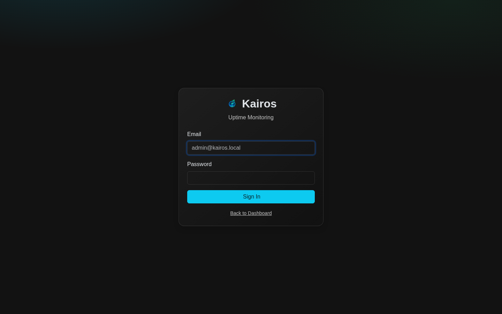
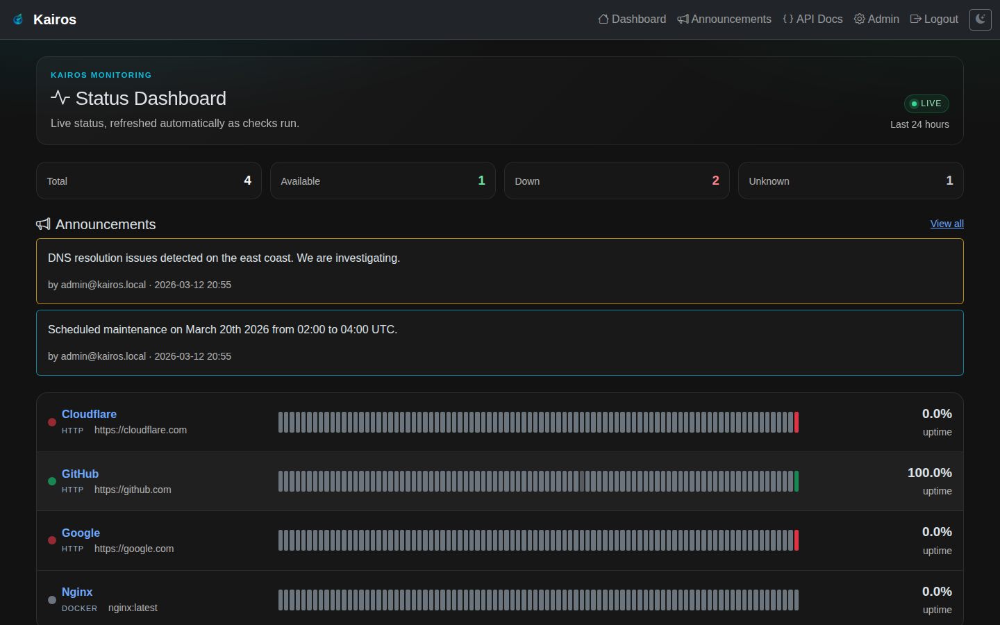
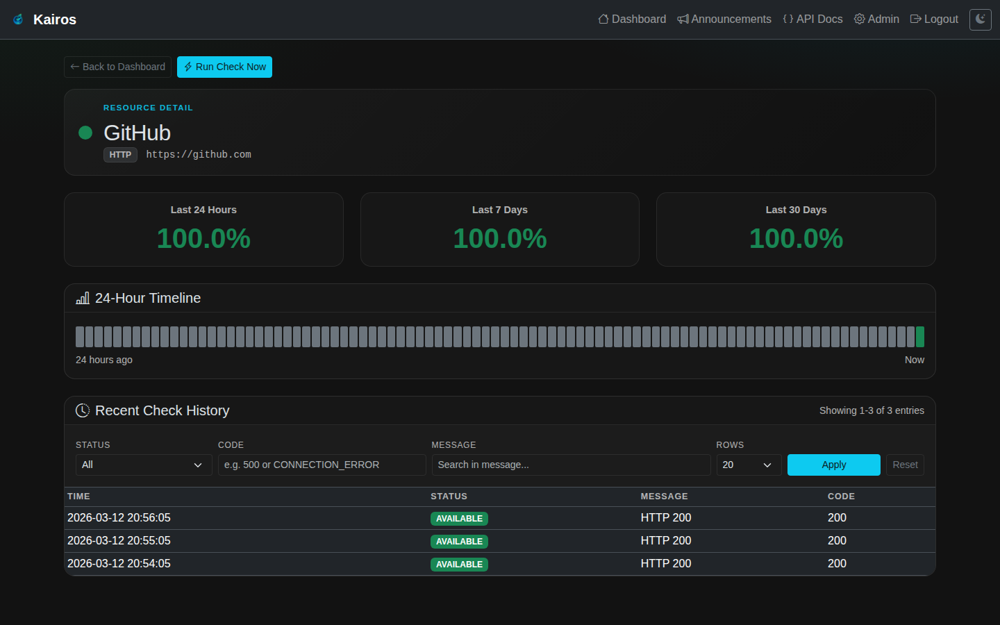
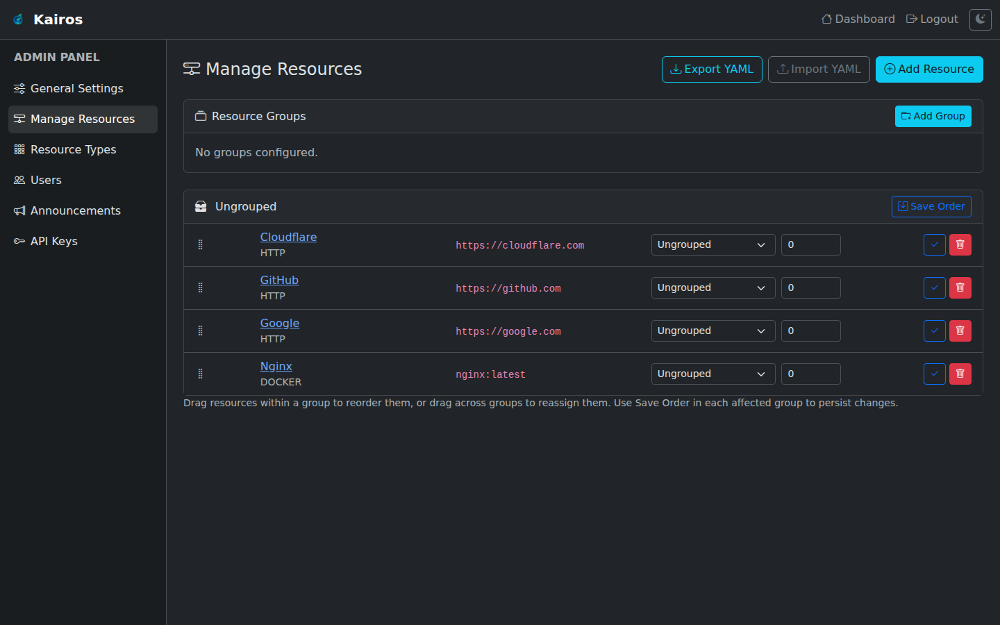
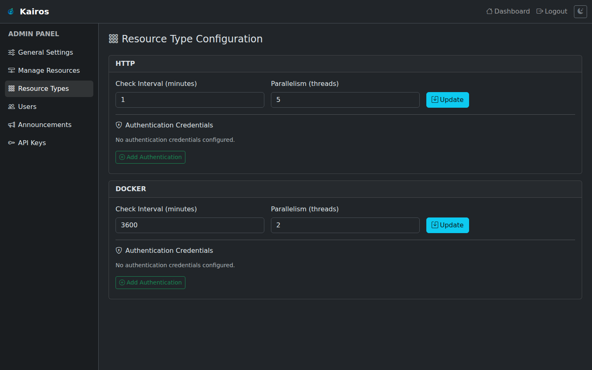
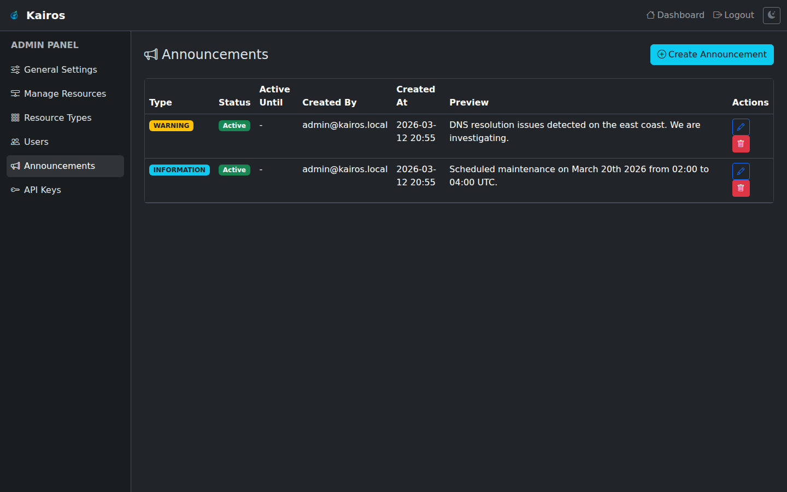
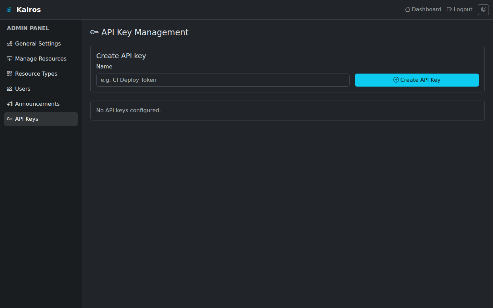
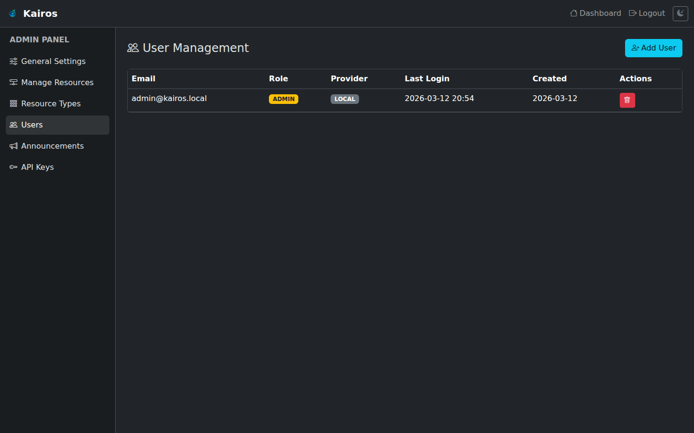
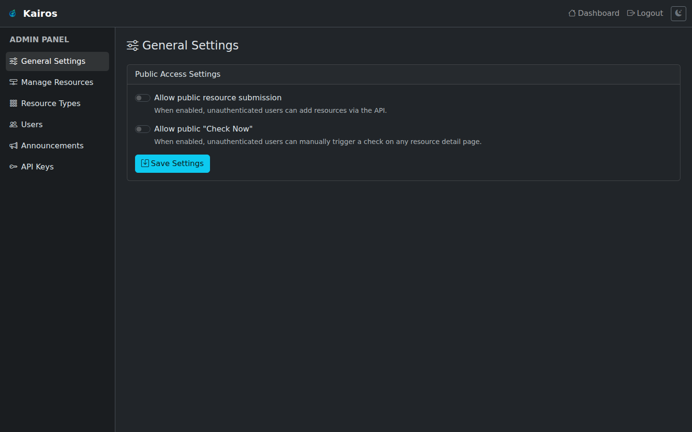

# Kairos — Uptime Monitor

**Kairos** is a self-hosted uptime and availability monitoring application built with Spring Boot. It periodically checks whether your HTTP services and Docker images are reachable, stores a full check history, and presents the results on a clean status dashboard — with Prometheus metrics included.

---

## Screenshots

### Login Page


### Status Dashboard


### Resource Detail


### Admin — Manage Resources


### Admin — Resource Type Configuration


### Admin — Announcements


### Admin — API Keys


### Admin — Users


### Admin — General Settings


---

## Features

- **HTTP monitoring** — HTTP GET checks with configurable interval and parallelism
- **Docker image monitoring** — validates image pullability via the OCI/Docker Registry HTTP API (manifest + blob probe, no Docker socket required)
- **Authentication support** — per-resource-type Basic Auth credentials with wildcard URL pattern matching; HTTP checks send an `Authorization: Basic …` header, Docker checks use credentials for registry API/token requests
- **Instant checks on startup** — monitoring begins immediately when the application starts; no waiting for the first interval tick
- **Status dashboard** — 24-hour timeline, uptime percentages (24 h / 7 d / 30 d), and a full check history per resource with filterable table
- **Manual instant checks** — admins can trigger an immediate check from the resource detail page, bypassing scheduler interval and parallelism queue
- **Public "Check Now"** — optionally allow unauthenticated users to trigger an immediate check from the resource detail page
- **Resource groups** — organise resources into named groups; drag-and-drop reordering within and across groups
- **Admin panel** — manage resources, tune check intervals and parallelism per resource type, manage users, configure authentication credentials
- **API keys** — generate and revoke named API keys for machine-to-machine access to the REST API
- **YAML import / export** — export resources from the admin panel and import them again via a versioned, forward-compatible YAML exchange format
- **Announcement system** — publish rich-text announcements with three severity kinds (`INFORMATION`, `WARNING`, `PROBLEM`), active/inactive state, optional auto-expiry (`active until`), creator and creation timestamp
- **Public announcements** — active announcements are shown on the dashboard and a dedicated public announcements page lists all announcements by creation date
- **Public submission mode** — optionally allow unauthenticated users to add resources via the REST API
- **OIDC / OAuth2 login** — plug in any OpenID Connect provider (Keycloak, Auth0, etc.)
- **Prometheus metrics** — `kairos_resource_status` gauge per resource, exposed at `/actuator/prometheus`
- **H2 (default) or PostgreSQL** — switch databases with a single property change
- **Dark-mode UI** — Bootstrap 5 with Bootstrap Icons, served via WebJars (no CDN dependency)

---

## Quick Start

### Prerequisites

- Java 17+
- Maven 3.8+ (or use the included `./mvnw`)
- Network access to target Docker/OCI registries if you want Docker image checks

### Run from source

```bash
git clone https://github.com/JFWenisch/Kairos.git
cd Kairos
./mvnw spring-boot:run
```

Open **http://localhost:8080** in your browser.

**Default credentials** (created automatically on first start):

| Email | Password |
|-------|----------|
| `admin@kairos.local` | `admin` |

> ⚠️ Change the default password immediately after first login via **Admin → Users**.

### Run with Docker

```bash
docker run -d \
  --name kairos \
  -p 8080:8080 \
  -v kairos-data:/app/data \
  ghcr.io/jfwendisch/kairos:latest
```

### Build a JAR

```bash
./mvnw package -DskipTests
java -jar target/kairos-0.0.1-SNAPSHOT.jar
```

### Run on Kubernetes with Helm

Kairos includes a production-ready Helm chart for Kubernetes deployments.

#### Prerequisites

- Kubernetes 1.20+
- Helm 3.0+

#### Install

```bash
helm install kairos ./charts/kairos -n kairos --create-namespace
```

#### With Persistence (H2 Database)

```bash
helm install kairos ./charts/kairos \
  -n kairos --create-namespace \
  --set persistence.enabled=true
```

#### With PostgreSQL

```bash
helm install kairos ./charts/kairos \
  -n kairos --create-namespace \
  --set env.SPRING_DATASOURCE_URL="jdbc:postgresql://postgres:5432/kairos" \
  --set env.SPRING_DATASOURCE_USERNAME="kairos" \
  --set secrets.SPRING_DATASOURCE_PASSWORD="your-password"
```

#### With Ingress

```bash
helm install kairos ./charts/kairos \
  -n kairos --create-namespace \
  --set ingress.enabled=true \
  --set ingress.className=nginx \
  --set ingress.hosts[0].host=kairos.example.com \
  --set ingress.hosts[0].paths[0].path=/ \
  --set ingress.hosts[0].paths[0].pathType=Prefix
```

For more Helm configuration options, see [charts/kairos/README.md](charts/kairos/README.md).

---

## Configuration

Kairos is configured via standard Spring Boot `application.properties` or environment variables.

| Property | Env var | Default | Description |
|----------|---------|---------|-------------|
| `spring.datasource.url` | `SPRING_DATASOURCE_URL` | `jdbc:h2:file:./kairos` | JDBC URL (H2 file or PostgreSQL) |
| `spring.datasource.username` | `SPRING_DATASOURCE_USERNAME` | `sa` | Database username |
| `spring.datasource.password` | `SPRING_DATASOURCE_PASSWORD` | *(empty)* | Database password |
| `OIDC_ENABLED` | `OIDC_ENABLED` | `false` | Enable OIDC / OAuth2 login |
| `OIDC_CLIENT_ID` | `OIDC_CLIENT_ID` | *(empty)* | OIDC client ID |
| `OIDC_CLIENT_SECRET` | `OIDC_CLIENT_SECRET` | *(empty)* | OIDC client secret |
| `OIDC_ISSUER_URI` | `OIDC_ISSUER_URI` | *(empty)* | OIDC issuer URI (e.g. `https://keycloak.example.com/realms/myrealm`) |

See [docs/configuration.md](docs/configuration.md) for advanced configuration including PostgreSQL setup, Docker socket access, and OIDC.

See [docs/authentication.md](docs/authentication.md) for details on configuring authentication credentials for resource checks.

See [docs/announcements.md](docs/announcements.md) for announcement management and behavior details.

## Documentation

- [docs/api.md](docs/api.md) — REST API endpoints, payloads and examples
- [docs/authentication.md](docs/authentication.md) — resource check authentication and credential matching
- [docs/configuration.md](docs/configuration.md) — runtime configuration, database setup and OIDC
- [docs/importexport.md](docs/importexport.md) — YAML import/export workflow, format and compatibility notes
- [docs/docker-pullability.md](docs/docker-pullability.md) — socketless Docker/OCI pullability validation behavior
- [docs/announcements.md](docs/announcements.md) — announcement features, permissions and lifecycle

See [docs/importexport.md](docs/importexport.md) for details about the admin resource import/export workflow and YAML schema compatibility.

---

## REST API

The REST API is available at `/api`. An **interactive Swagger UI** (auto-generated from the OpenAPI spec) is served at **[/api](http://localhost:8080/api)** — no separate tooling needed.

The raw OpenAPI JSON spec is at `/v3/api-docs`.

| Method | Path | Auth | Description |
|--------|------|------|-------------|
| `GET` | `/api/resources` | Public | List all active resources |
| `GET` | `/api/resources/{id}` | Public | Get resource details + latest health status |
| `POST` | `/api/resources` | Admin | Add a new resource |
| `DELETE` | `/api/resources/{id}` | Admin | Delete a resource |
| `GET` | `/api/resources/{id}/history` | Authenticated | Full check history for a resource |
| `GET` | `/api/announcements` | Public | List all announcements |
| `GET` | `/api/announcements/{id}` | Public | Get a single announcement |
| `POST` | `/api/announcements` | Admin | Create an announcement |
| `PUT` | `/api/announcements/{id}` | Admin | Update an announcement |
| `DELETE` | `/api/announcements/{id}` | Admin | Delete an announcement |

See [docs/api.md](docs/api.md) for full request/response examples.

---

## Monitoring with Prometheus

Kairos exposes a Prometheus-compatible endpoint at `/actuator/prometheus`. The key metric is:

```
kairos_resource_status{resource_name="GitHub",resource_type="HTTP"} 1.0
```

Values: `1` = available, `0` = not available, `-1` = unknown (no checks yet).

A health endpoint is also available at `/actuator/health`.

---

## Development

```bash
# Run tests
./mvnw test

# Run with H2 console enabled (default — open http://localhost:8080/h2-console)
./mvnw spring-boot:run
```

---

## License

[GNU GPL v3.0](LICENSE.md)