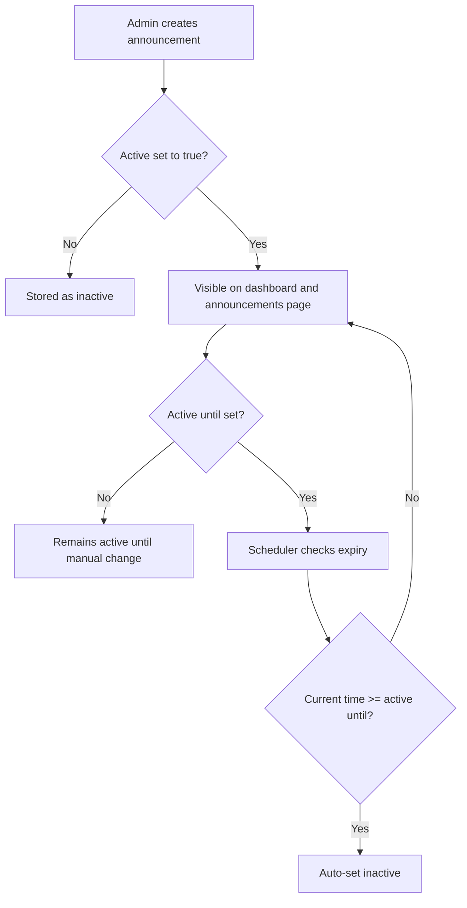

# Announcements

Kairos includes a built-in announcement system for publishing service communication to all visitors.

## What announcements are used for

Announcements are shown on the public dashboard to communicate planned maintenance, known issues, or general information.

Each announcement supports:

- **Rich text content** (bold, links, lists, paste from clipboard)
- **Kind** with visual severity:
  - `INFORMATION` (info style)
  - `WARNING` (warning style)
  - `PROBLEM` (problem/error style)
- **Status**: `active` or `inactive`
- Optional **active until** datetime (automatic deactivation)
- **Created by** (user who created the announcement)
- **Created at** timestamp

## Public visibility

- The dashboard (`/`) shows **active** announcements above monitored resources.
- The announcements page (`/announcements`) is publicly visible and shows all announcements sorted by creation date (newest first).
- Viewing announcements does **not** require authentication.

## Admin management

Announcement administration is available under:

- `Admin -> Announcements`

Admin users can:

- Create announcements (`/admin/announcements/new`)
- Edit existing announcements
- Delete announcements
- Set status (`active` / `inactive`)
- Set optional `active until` datetime

Only admins can access `/admin/**` routes, so creating, editing and deleting announcements is restricted to admin users.

## Automatic deactivation behavior

If **active until** is set, Kairos automatically sets the announcement to `inactive` once the configured datetime is reached.

Notes:

- If `active until` is empty, the announcement remains active until manually changed.
- Automatic deactivation is handled by a scheduled backend task.

## Typical workflow

1. Open `Admin -> Announcements`.
2. Click **Create Announcement**.
3. Choose kind (`INFORMATION`, `WARNING`, `PROBLEM`).
4. Enter rich-text content.
5. Keep `active` enabled for immediate publication.
6. Optionally set `active until` for automatic expiry.
7. Save.

The announcement appears immediately on the public dashboard when active.
