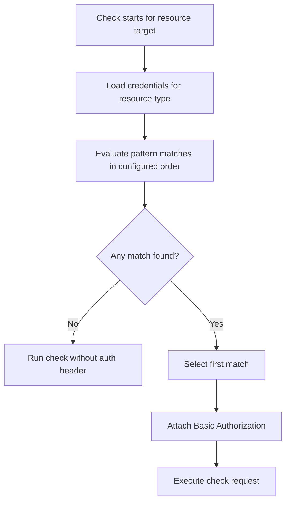

# Authentication for Resource Checks

Kairos supports attaching authentication credentials to resource type configurations. When a check runs, Kairos automatically resolves the correct credentials by matching the resource's target against the configured URL patterns.

---

## Overview

Credentials are managed per checker/discovery configuration:

- **Resource Types** for runtime checks (for example `HTTP`, `DOCKER`)
- **Resource Discovery** for discovery sync sources (for example `DOCKER_REPOSITORY`)

Each credential entry has:

| Field | Description |
|-------|-------------|
| **Name** | A human-readable label to identify the credential. |
| **URL / Target Pattern** | The pattern used to match against the resource target. Supports a trailing `*` wildcard. |
| **Username** | Username for the authentication. |
| **Password** | Password or token for the authentication. |

Currently the only supported authentication type is **Basic Auth**.

---

## URL Pattern Matching

The URL pattern is matched against the full resource target string (e.g. `https://example.com/api` for HTTP, or `registry.example.com/myimage:latest` for Docker).

### Rules

- **Exact match** — The pattern matches only if it is identical to the resource target.
  ```
  Pattern:  https://example.com
  Target:   https://example.com     → ✅ match
  Target:   https://example.com/api → ❌ no match
  ```

- **Trailing wildcard (`*`)** — A single `*` at the end of the pattern matches any suffix (including slashes and paths).
  ```
  Pattern:  https://example.com*
  Target:   https://example.com          → ✅ match
  Target:   https://example.com/api      → ✅ match
  Target:   https://example.com/api/v2   → ✅ match
  Target:   https://other.example.com    → ❌ no match
  ```

When multiple credentials could match a target, the first one found is used. Order the credentials from most specific (no wildcard) to least specific (broad wildcard) to ensure the right credential is selected.



---

## Managing Credentials in the Admin Panel

1. Navigate to **Admin → Resource Types** (for HTTP/DOCKER checks) or **Admin → Resource Discovery** (for discovery sync).
2. Find the type you want to configure.
3. Click **Add Authentication** to expand the form.
4. Fill in the fields:
   - **Name** — e.g. `My Private Registry`
   - **URL / Target Pattern** — e.g. `https://private.example.com*`
   - **Username** and **Password**
5. Click **Save**.

The credential is immediately active; the next scheduled check that matches the pattern will use it.

To remove a credential, click the red trash icon in the credentials table.

---

## How Authentication Works per Check Type

### HTTP Checks

When a matching credential is found, Kairos adds an `Authorization: Basic <base64(username:password)>` header to the outgoing HTTP GET request.

**Example setup:**

| Field | Value |
|-------|-------|
| URL Pattern | `https://internal.example.com*` |
| Username | `monitor` |
| Password | `s3cret` |

Any HTTP resource whose target starts with `https://internal.example.com` will include the Basic Auth header automatically.

---

### Docker Checks

When a matching credential is found, Kairos sends `Authorization: Basic ...` for registry API requests and token endpoint requests when Bearer-token negotiation is required. No `docker login` command is executed. Kairos then probes blob download access to validate pullability, not only manifest visibility.

The registry is extracted from the image reference:

| Image Reference | Resolved Registry |
|-----------------|-------------------|
| `nginx:latest` | Docker Hub (default) |
| `ghcr.io/owner/image:tag` | `ghcr.io` |
| `registry.example.com/myimage:tag` | `registry.example.com` |

**Example setup for GitHub Container Registry:**

| Field | Value |
|-------|-------|
| Name | `GHCR` |
| URL Pattern | `ghcr.io*` |
| Username | `github-username` |
| Password | `ghp_yourPersonalAccessToken` |

Any Docker resource whose target starts with `ghcr.io` will use those credentials for registry authentication.

**Example setup for a self-hosted registry:**

| Field | Value |
|-------|-------|
| Name | `Internal Registry` |
| URL Pattern | `registry.example.com*` |
| Username | `deploy` |
| Password | `registrypassword` |

Any Docker resource whose target starts with `registry.example.com` will use those credentials for registry authentication.

For `DOCKER_REPOSITORY` discovery services, credentials are configured in **Admin -> Resource Discovery** and used for registry discovery requests and, for GHCR owner discovery, for GitHub API calls when patterns match.

> **Note:** Registry checks are socketless and do not need local Docker/Podman binaries.

---

## Wildcard Tips

| Pattern | Matches |
|---------|---------|
| `https://example.com` | Exactly `https://example.com` |
| `https://example.com*` | Anything beginning with `https://example.com` |
| `registry.example.com*` | Any Docker image from `registry.example.com` |
| `ghcr.io*` | Any image from GitHub Container Registry |

---

## Security Considerations

- Credentials are stored **unencrypted** in the Kairos database. Use a PostgreSQL instance with restricted access or enable disk encryption when running in production.
- Avoid using root/admin credentials where possible; prefer read-only or pull-only tokens.
- Rotate credentials regularly and update them in the admin panel.
