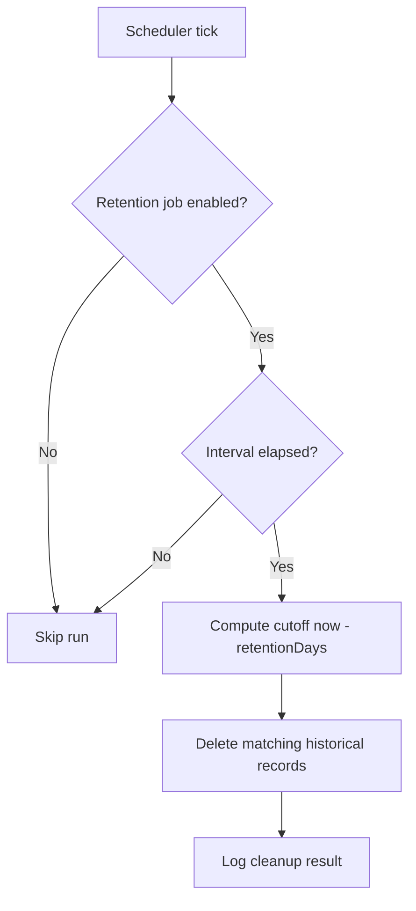

# Configuration: Check Scheduling

This page describes how check intervals and parallelism work.

## Resource Type Defaults

| Resource Type | Default Interval | Default Parallelism |
|---------------|------------------|---------------------|
| HTTP | 1 minute | 5 threads |
| DOCKER | 5 minutes | 2 threads |

Settings are managed in **Admin -> Resource Types**.

## Resource Discovery Defaults

| Discovery Service Type | Default Sync Interval | Default Parallelism |
|------------------------|-----------------------|---------------------|
| DOCKER_REPOSITORY | 60 minutes | 1 thread |

Settings are managed in **Admin -> Resource Discovery**.

## How Scheduler Timing Works

- The scheduler loop runs every 30 seconds.
- A resource type run is dispatched when `now - lastRun >= interval`.
- Parallelism controls concurrent checks for that type.

## Startup Behavior

Kairos always performs an immediate check pass at startup, independent of configured intervals.

## Outage Detection and Recovery

Outages are evaluated per resource type and configured in **Admin -> Resource Types**.

| Setting | Default | Meaning |
|---------|---------|---------|
| Outage threshold | `3` | Open an outage after this many consecutive `NOT_AVAILABLE` check results |
| Recovery threshold | `2` | Close an active outage after this many consecutive `AVAILABLE` check results |

Outage lifecycle:

- At most one active outage is kept per resource.
- Outage start time is based on the first failing check in the triggering failure streak.
- Outage end time is set to the check time that satisfies the recovery threshold.

Operational notes:

- Public outage overview page: `/outages`
- Resource detail pages include active outage banner and outage history table
- Dashboard rows/cards show active outage indicators with live elapsed time

## Retention Jobs

Kairos runs retention in dedicated background jobs. Both jobs are configured in **Admin -> General Settings** and run independently from check execution.

### Check History Retention

- Controls: `checkHistoryRetentionEnabled`, `checkHistoryRetentionIntervalMinutes`, `checkHistoryRetentionDays`
- Default interval: 60 minutes
- Default retention: 31 days
- Deletion reference: `check_result.checked_at`

### Outage Retention

- Controls: `outageRetentionEnabled`, `outageRetentionIntervalHours`, `outageRetentionDays`
- Default interval: 12 hours
- Default retention: 31 days
- Deletion reference: `outage.endDate`
- Only closed outages are removed; active outages are never deleted by retention.

### Retention Flow

### Safety Notes

- Set retention values according to compliance and incident review requirements.
- Outage retention uses end date to preserve full incident duration before deletion.
- If you need long-term analytics, export data before lowering retention days.

## DOCKER_REPOSITORY Discovery Behavior

`DOCKER_REPOSITORY` sync runs do not create direct check entries.

Instead, each run synchronizes discovered images into generated `DOCKER` resources in an auto-created group and removes resources that no longer exist in the upstream registry.
