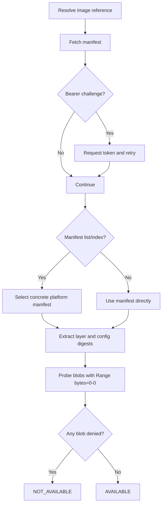

# Docker Registry Pullability Checks

Kairos validates Docker/OCI image **pullability** without requiring Docker Engine, Podman, containerd, or a mounted socket.

For `DOCKERREPOSITORY` resources, Kairos first discovers matching repositories (for example from `ghcr.io/<owner>`), then creates/updates generated `DOCKER` resources for each discovered image. Pullability checks are executed on those generated Docker resources.

## Why this exists

Some registries allow manifest access but block actual layer downloads due to policy enforcement (for example CVE policies). A simple manifest check can report a false positive in those cases.

Kairos therefore performs a deeper registry-level pullability probe.

## How Kairos checks pullability

For each Docker resource, Kairos performs the following over HTTPS:

1. Resolve image reference (`registry/repository:tag` or digest)
2. Request the manifest (`GET /v2/<repo>/manifests/<ref>`)
3. Handle Bearer auth challenge and token flow when required
4. If the reference is a manifest list/index, resolve to a concrete platform manifest (prefers `linux/amd64`, otherwise first entry)
5. Extract config and layer blob digests
6. Probe each blob with a tiny range request (`GET /v2/<repo>/blobs/<digest>` + `Range: bytes=0-0`)

If any blob probe is denied (for example `401` or `403`), the check is marked as failed.

## Authentication behavior

- A configured Docker credential is sent as `Authorization: Basic ...`.
- If the registry responds with `WWW-Authenticate: Bearer ...`, Kairos requests a token and retries with `Authorization: Bearer ...`.
- Scope defaults to `repository:<repo>:pull` when not explicitly provided by the challenge.

## TLS behavior

`skipTLS` on a resource also applies to Docker registry checks.

For `DOCKERREPOSITORY`, `skipTLS` also applies during repository discovery API calls.

When enabled, Kairos bypasses certificate-chain and hostname verification for that resource's HTTPS calls.

## Operational notes

- This is still a **read-only** check; Kairos does not pull or store full image layers locally.
- No Docker CLI login is performed and no `~/.docker/config.json` is written.
- Designed for hardened Kubernetes environments where socket mounts are disallowed.
